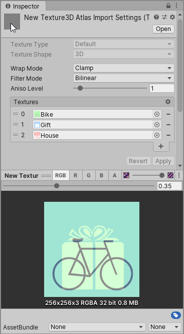

# Texture3D Atlas Import Pipeline for Unity

Unity has no built-in import pipeline for Texture3D's in Unity 2020.1 and earlier versions yet.
This Texture3D Atlas Import Pipeline package provides the ability to create a Texture3D asset from a collection of regular 2D textures. It's similar to a Texture2DArray, but a Texture3D Atlas supports to blend between its 'slices'.

This Texture3D Atlas Import Pipeline is an editor extension, it does not contain code that is required at runtime.



# Installation

In order to use this Texture3D Atlas Import Pipeline, you have to add the package to your project. As of Unity 2019.3, Unity supports to add packages from git through the Package Manager window.

In Unity's Package Manager, choose "Add package from git URL" and insert one of the Package URL's you can find below.

## Package URL's

| Version  |     Link      |
|----------|---------------|
| 1.1.0 | https://github.com/pschraut/UnityTexture3DAtlasImportPipeline.git#1.1.0 |
| 1.0.0 | https://github.com/pschraut/UnityTexture3DAtlasImportPipeline.git#1.0.0 |


# Unity Bugs
| Bug | Fixed in | Description |
|-----|:--------:|-------------|
| [1208832](https://issuetracker.unity3d.com/issues/unable-to-create-a-texture3d-with-a-compressed-format) | 2020.2.0b8, 2020.1 | Texture3D does not support compressed formats. Texture3DAtlas only supports RGBA32/ARGB32 uncompressed texture formats in 2019.3/.4. Using uncompressed textures requires more bandwidth and might lead to worse performance than necessary. If you want to this this bug fixed in Unity 2019.4, please [submit a bug-report to Unity Technologies](https://unity3d.com/unity/qa/bug-reporting). |
| [1249421](https://issuetracker.unity3d.com/issues/an-error-is-thrown-in-the-console-window-when-copying-a-compressed-texture2d-with-graphics-dot-copytexture-to-texture3d)| 2020.2.0a16 | An error is thrown in the Console Window when copying a Compressed Texture2D with Graphics.CopyTexture to Texture3D.  If you want to this this bug fixed in Unity 2019.4, please [submit a bug-report to Unity Technologies](https://unity3d.com/unity/qa/bug-reporting).|
| [1262413](https://forum.unity.com/threads/case-1262413-graphics-copytexture-doesnt-work-to-copy-compressed-texture2d-in-texture3d.929628/)| n/a | Using Graphics.CopyTexture to copy the content of a Texture2D object in a Texture3D slice, does not work, if the Texture2D uses a compressed texture format.  If you want to this this bug fixed in Unity 2019.4, please [submit a bug-report to Unity Technologies](https://unity3d.com/unity/qa/bug-reporting).|

# How it works

## Overview

It uses Unity's [ScriptedImporter](https://docs.unity3d.com/Manual/ScriptedImporters.html). ScriptedImporter allows to implement custom asset importers in C# for file formats not natively supported by Unity.

A Texture3D object is natively supported by Unity, but has no import pipeline yet. What I created is a ScriptedImporter that handles files ending with .texture3datlas as a Texture3D object.

Combined with a custom [ScriptedImporterEditor](https://docs.unity3d.com/ScriptReference/Experimental.AssetImporters.ScriptedImporterEditor.html),  the integration feels quite smooth.


## Texture format and size

The texture size and format of a Texture3D is taken from the first input texture, the texture used for slice 0. Thus the Texture3D asset will have the same size and format as the texture specified in slice 0. All input textures have to use the same size and format.

Input textures are copied into the Texture3D with no modifications, thus they all need to match. If they don't match, you'll see an error why the Texture3D could not be created and the Texture3D is changed to solid magenta to indicate there is an issue that must be fixed.

If you want to use different texture formats/sizes for different target platforms, this is fully supported. You just need to specify the format and size in the input textures, not in the Texture3D asset

### Limitation due to Unity bugs
Because of the issues listed under "Unity bugs" in this document, the following limitation applies:

* The texture format is currently limited to RGBA32 and ARGB32 uncompressed texture formats only, because Unity allows to create Texture3D's with these two formats only.
* The texture must tick the 'Read/Write Enabled' flag ticked in the Texture Importer, because [Graphics.CopyTexture](https://docs.unity3d.com/ScriptReference/Graphics.CopyTexture.html) fails for Texture3D objects and to workaround this issue, I use [GetPixels32](https://docs.unity3d.com/ScriptReference/Texture2D.GetPixels32.html)/SetPixels32 to copy data from one texture to the Texture3D object. 

This isn't an ideal solution, but once Unity Technologies fixes these issue, I can add support to use and generate compressed textures too.


## Dependency handling

A Texture3D asset is built from several input textures. The content of those input textures is copied into the Texture3D asset.

The import pipeline registers these input textures as dependencies. This means if a texture that is used by a Texture3D asset changes, the Texture3D asset gets reimported automatically as well.

It's a really neat feature, as you don't need to hit a rebuild button to update the Texture3D every time you change one of its input textures.

## Platform handling

If you change the target platform in Unity, for example from PC Standalone to Android, Unity starts to reimport assets for that particular target platform you chose. This will also cause the Texture3D asset to get reimported and it will use size of its input textures as described earlier.


# Create Texture3D Atlas asset

* Open the project window context menu via right-mouse click.
* Choose "Create > Texture3D Atlas" from the menu. This will create a new Texture3D Atlas asset in the current directory.
* Once you created the asset, it's selected in the Inspector.
* A new Texture3D Atlas has no input textures yet. It only contains a "dummy slice" that is solid magenta to indicate you need to add textures. The Texture3D Atlas at this point is already fully functional though.
* In order to add textures you can click the plus (+) button or just drag&drop your textures onto the list header.
* Add a texture to each slice.
* Press the "Apply" button.


## Import error

If the Texture3D Atlas is still solid magenta after you pressed "Apply", it's very likely there was an issue with the setup. Please take a look at the Unity Console window for any import error. Open the Console from the main menu "Window > General > Console".


# AssetPostprocessor Example

If you want to automate a certain Texture3D Atlas setup every time you create a new Texture3D Atlas asset, you can do this using Unity's AssetPostprocessor API and hook into the OnPreprocessAsset callback to configure the texture array to your like.

```csharp
using UnityEditor;
using UnityEngine;

class Example : AssetPostprocessor
{
    void OnPreprocessAsset()
    {
        // If the asset has not imported yet...
        if (assetImporter.importSettingsMissing)
        {
            // Gets its importer and apply default settings
            var importer = assetImporter as Oddworm.EditorFramework.Texture3DAtlasImporter;
            if (importer != null)
            {
                importer.filterMode = FilterMode.Point;
                importer.wrapMode = TextureWrapMode.Clamp;
                importer.anisoLevel = 0;
            }
        }
    }
}
```